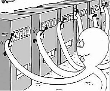
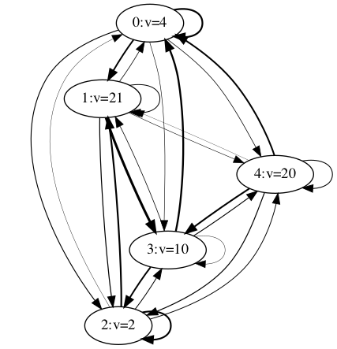

# Reinforcement_Learning_Toys
Some reinforcement learning algorithm implementations. Toy models ~

# Contents 

| Topic |  Link  |
|  :----:  | :----: |
|  Multi-armed bandit (epsilon-greedy/UCB) |  |
| Markov decision process  | link |

# Detailed introduction

## Multi-armed Bandits

Multi-armed bandit problem (MAB) is a simple and fundamental example for reinforcement learning, and has been used in real world tasks (recommender sys etc.).

Defination ( from wiki ):

In probability theory, the multi-armed bandit problem (sometimes called the K- or N-armed bandit problem) is a problem in which a fixed limited set of resources must be allocated between competing (alternative) choices in a way that maximizes their expected gain, when each choice's properties are only partially known at the time of allocation, and may become better understood as time passes or by allocating resources to the choice. [wiki:multi-armed bandits](https://en.wikipedia.org/wiki/Multi-armed_bandit)

In the MAB problem, agent uses the previous reward in the earlier actions to estimate the value of each arm, and try to maximize the expected gain for each action.

## Markov Reward Process (MRP) and Markov Decision Process (MDP)

Both MRP and MDP obey Markovian property, i.e. "the future is independent of the past if present state is given".

### Markov Reward Process (MRP) : the state transition is independent of our actions

Markov reward model or Markov reward process is a stochastic process which extends either a Markov chain or continuous-time Markov chain by adding a reward rate to each state. (from [wiki](https://en.wikipedia.org/wiki/Markov_reward_model)).

 In MRP, each state returns a reward, and the transition of states are only related to the current state.

The transition probability is:

The reward of each state is defined as a one-param function:

###  Markov Decision Process (MDP) : the state transition controlled by current state and action.

Markov decision process (MDP) is a discrete-time stochastic control process. It provides a mathematical framework for modeling decision making in situations where outcomes are partly random and partly under the control of a decision maker. (from [wiki](https://en.wikipedia.org/wiki/Markov_decision_process))

The transition probability from state S_i to S_j under action A_k is defined as follows:

The reward function of MDP has two parameters:

