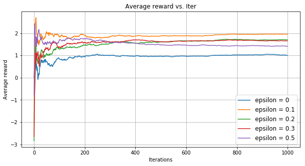
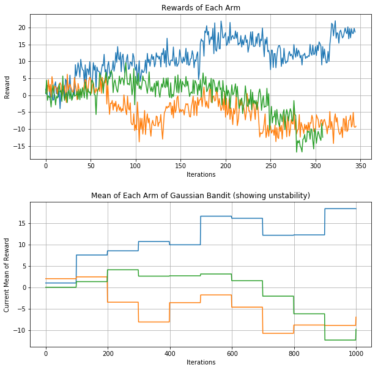

# Multi-armed Bandit 

**Multi-armed bandit (MAB)** is a quite simple and easy to implement toy problem for understanding the concept of reinforcement learning. The codes here solve the MAB by epsilon-greedy strategy and UCB (Upper Confidence Bound) strategy for action selection, using the straightforward reward expectation as the Q value.

## Preliminary results
* 5-armed stable gaussian bandit training for 200 epoches (using epsilon greedy action selection).

* different epsilons for epsilon-greedy

* solving unstable gaussian bandit using given stride alpha to enhance the weight of nearby rewards.

the unstable gaussian bandit is shown below, indicating the mean(reward) of each arm all changes with time.

comparison alpha stride and common (1/n) stride for unstable MAB problem

